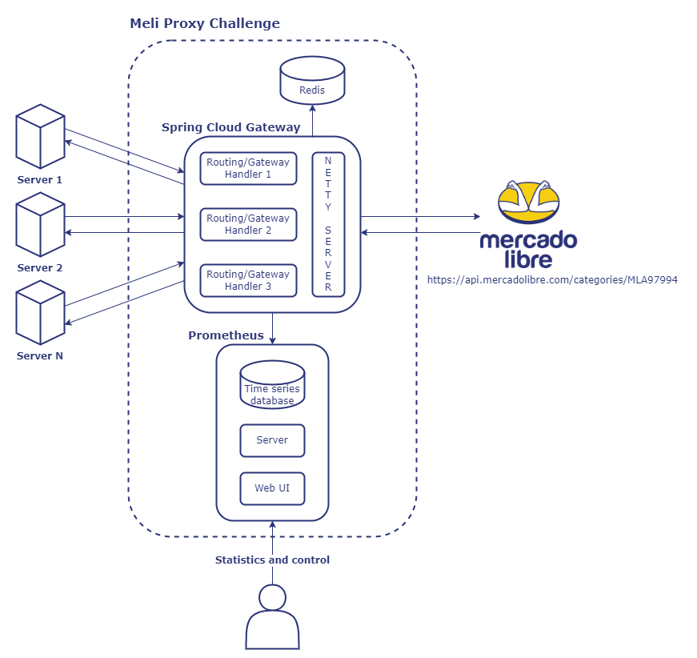

# Meli Proxy Challenge

API proxy developed for the Mercadolibre technical challenge. This project uses Spring Boot and Spring Cloud Gateway to create a reverse proxy for routing incoming requests to the appropriate microservice. This project includes rate limiting as one of the features provided by Spring Cloud Gateway. Prometheus is also used for monitoring and collecting metrics.

## Getting Started

These instructions will guide you on how to get a copy of the project up and running on your local machine for testing purposes.

### Prerequisites

- Docker: This project uses Docker to run the application and its dependencies. Make sure you have Docker installed on your machine before proceeding. You can download it from [here](https://www.docker.com/get-started).

### Usage

To run the application, use the following command in the command line:
```
docker-compose up
```

This command will start the application and all its dependencies in containers.

To test the endpoint, use the following command:
```
curl http://localhost:8080/categories/MLA97994
```

You can also access the statistics dashboard at [http://localhost:9090](http://localhost:9090/graph?g0.expr=spring_cloud_gateway_requests_seconds_count&g0.tab=0&g0.stacked=0&g0.show_exemplars=0&g0.range_input=1h) to see the metrics collected by Prometheus.

### Tests

To run the tests for the project, use the following command:
```
mvn '-Dtest=ProxyApplicationTests' test
```

This command will run the tests for the `ProxyApplicationTests` class.

## Solution diagram

The following diagram illustrates how the different components of the solution are interconnected:


### Dashboard example

Here's an example of what the Prometheus dashboard may look like:


## Built With

* [Spring Boot](https://spring.io/projects/spring-boot) - Java-based framework
* [Spring Cloud Gateway](https://spring.io/projects/spring-cloud-gateway) - API Gateway for Spring Boot applications
* [Maven](https://maven.apache.org/) - Dependency management
* [Prometheus](https://prometheus.io/) - Monitoring system